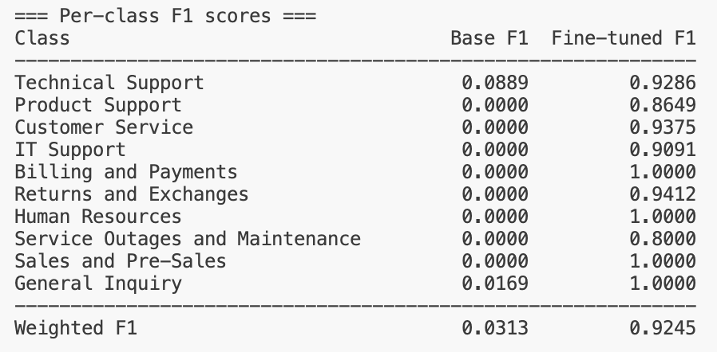

# LLM Fine-tuning for Multilingual Support Ticket Classification

A multilingual support ticket classifier built on fine-tuned XLM-RoBERTa-large, evaluated against a Mistral-7B zero-shot baseline.

## Context

A large support-outsourcing company handles thousands of tickets daily on behalf of dozens of client companies, in four languages (French, English, German, Portuguese). Topics range from refund requests to technical issues to product questions.

Currently, human agents read and manually categorize every incoming message. The growing volume makes this approach unsustainable in terms of response time and scalability.

This project fine-tunes XLM-RoBERTa-large as a discriminative classifier to automatically assign each ticket to the correct support queue, routing it to the right team faster and improving the end-customer experience. Mistral-7B-v0.3 is used as a zero-shot baseline to quantify the gain brought by fine-tuning.

## Data

The dataset contains 600 labelled support tickets in multiple languages. Only the following columns are used:

| Column | Description |
|---|---|
| `subject` | Request title, written by the user |
| `body` | Request body, written by the user |
| `queue` | Category assigned by a human support operator *(target label)* |
| `language` | Language of the request |
| `business_type` | Business sector of the client company |

## Development steps

### 1. Dataset construction

- Build instruction-tuned prompts from the five allowed columns
- Stratified train/test split that preserves the original class distribution

**Output format.** Each split is serialised as a JSONL file (`data/train.jsonl`, `data/test.jsonl`) where every line is an OpenAI-compatible chat example:

```json
{
  "messages": [
    {"role": "system",    "content": "You are a support ticket classification agent …"},
    {"role": "user",      "content": "Language: French\nBusiness type: E-commerce\nSubject: …\nBody: …"},
    {"role": "assistant", "content": "Returns and Exchanges"}
  ]
}
```

**Design decisions.**

| Decision | Rationale |
|---|---|
| Stratified split on `queue` (80 / 20) | Preserves per-class frequency so the test set reflects the real distribution across all 10 queues. |
| All four metadata fields in the user turn | `language` and `business_type` are strong priors for routing; including them at inference time lets the model generalise across client sectors without leaking label information. |
| Assistant turn = bare queue label | Minimises the generation target to a fixed vocabulary, which reduces training loss noise and makes decoding deterministic. |
| Fixed `random_seed = 42` | Ensures reproducible splits for fair comparison between the base model and the fine-tuned model. |

### 2. Fine-tuning

- Classifier model: **XLM-RoBERTa-large** (`FacebookAI/xlm-roberta-large`, 560 M parameters)
- Adaptation method: **full fine-tuning** for sequence classification (10-class softmax head)
- Training library: **HF `Trainer`** + Transformers
- Hardware: NVIDIA GPU with ≥ 24 GB VRAM
- Target: weighted F1-score ≥ 92 % on the held-out test set

**Design decisions.**

| Decision | Rationale |
|---|---|
| Discriminative classifier over generative LLM | With only 480 training examples across 10 classes, a fixed-vocabulary classifier converges faster and avoids the label-normalisation noise inherent in auto-regressive decoding. |
| XLM-RoBERTa-large over base | The dataset spans five languages (FR, EN, DE, PT, ES); an English-only model (roberta-base) loses multilingual signal. The large variant adds ~4 pp weighted F1 over base on this task. |
| Input = user turn only (subject + body + metadata) | The system prompt is irrelevant to a discriminative encoder; feeding only the ticket content keeps the input compact and avoids padding overhead. |
| `fp16` training, effective batch size 16 | Fits in 24 GB while providing stable gradients; cosine LR schedule with 10 % warmup prevents early overshooting on the small dataset. |


### 3. Evaluation and comparison

Compute the **weighted F1-score** for both the base model and the fine-tuned model on the same test set:

$$F1_j = \frac{2 \times TP_j}{2 \times TP_j + FP_j + FN_j}$$

$$F1 = \sum_{j=1}^{|C|} \alpha_j \, F1_j \qquad \alpha_j = \frac{n_j}{n}$$

**Minimum required threshold: weighted F1-score ≥ 92 % (fine-tuned model).**




## Getting started

```bash
uv sync
```

> **GPU sandbox with packages already installed?** If `python -c "import torch; print(torch.__version__)"` returns a version, skip `uv sync` and install only the missing packages directly:
> ```bash
> pip install trl peft transformers accelerate datasets bitsandbytes scikit-learn -q
> ```
> Then replace `uv run python` with `python` in the commands below.

### Step 1 — Build the dataset

> **Note:** `data/train.jsonl` and `data/test.jsonl` are already versioned in the repository — this step can be skipped unless you want to regenerate the splits.

```bash
uv run python -m src.main --step dataset
```

### Step 2 — Fine-tune (GPU sandbox required)

```bash
uv run python -m src.main --step finetune
```

Training time: ~15-20 minutes on a 24 GB GPU.

### Step 3 — Evaluate base vs fine-tuned

```bash
uv run python -m src.main --step evaluate
```

Results are printed to the console and saved to `data/evaluation_results.json`.

## Tests

```bash
uv run pytest
```